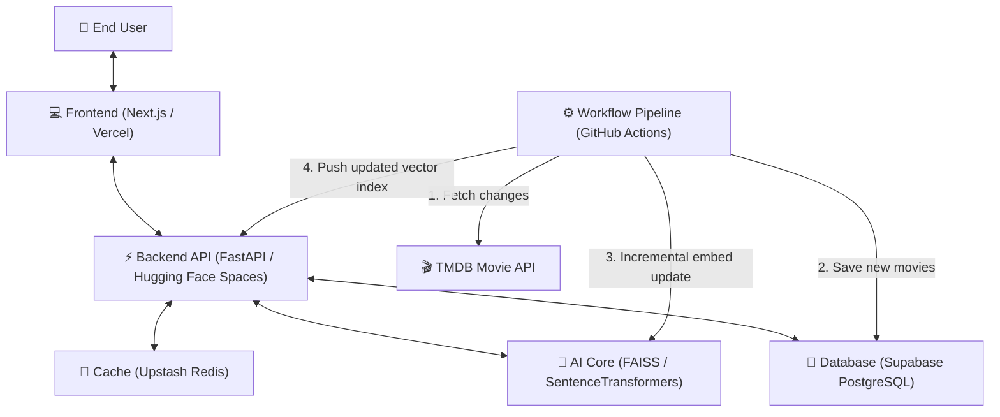

# 🎬 CineRecs — Project Architecture & Tech Stack

This document provides a detailed breakdown of the **CineRecs** project structure, its core components, how they are connected, and the technologies used in the stack.

---

## 🏗️ System Architecture Overview

CineRecs is a hybrid movie recommendation and search system. Below is a diagram showing how the frontend, backend, databases, caching layer, and background synchronization pipelines communicate:

---

## 🛠️ The Tech Stack

### 1. Frontend
* **Technology:** Next.js (React) + Tailwind CSS
* **Hosting Platform:** Vercel
* **Primary Role:** User interface, handling auth flow redirection, rendering search pages, recommendations rows, and autocomplete dropdowns.
* **Why it's used:** Next.js offers high-performance rendering, routing, and developer-friendly page abstractions. Tailwind CSS allows rapid creation of custom, dark-themed responsive styles (utilizing glassmorphism and gradient accents).

### 2. Backend API
* **Technology:** FastAPI (Python)
* **Hosting Platform:** Hugging Face Spaces
* **Primary Role:** Serves REST API requests from the frontend, coordinates database queries, runs vector similarity searches, handles user registration/login, and executes caching strategies.
* **Why it's used:** FastAPI is one of the fastest Python frameworks available, supports asynchronous programming (`async/await`), and runs cleanly on lightweight hosting spaces.

### 3. Primary Database
* **Technology:** Supabase PostgreSQL
* **Primary Role:** Long-term storage of user accounts, ratings, watchlist states, and complete metadata for **93,687 movies**.
* **Special Details:** Since IPv6 direct connections fail in IPv4-only server hosts (such as Hugging Face Spaces and GitHub Actions), connection routing goes through the **Supavisor connection pooler (Session Mode, port 5432)** with `sslmode=require`.

### 4. Cache Store
* **Technology:** Upstash Redis
* **Primary Role:** Temporarily caches high-traffic queries like trending movie lists, exact search details, and vector match computations.
* **Why it's used:** Cuts down response times to ~2ms for repeated actions and reduces direct database query overhead.

### 5. Recommendation Core (AI)
* **Technology:** SentenceTransformers (`all-MiniLM-L6-v2`) + FAISS (Facebook AI Similarity Search)
* **Primary Role:** Performs semantic searches and generates movie-to-movie recommendations:
  * **SentenceTransformers:** Formats movie metadata (title + genres + cast + overview) into a **384-dimension vector** representing its meaning.
  * **FAISS:** A vector database engine that matches the search query vector to movie vectors in-memory using Cosine Similarity.

---

## 🔗 How Key Features Work End-to-End

### 1. User Sign Up & Authentication
1. User enters their email and password in the frontend.
2. Frontend triggers a `POST` request to the backend's `/auth/register` endpoint.
3. The backend hashes the password using `bcrypt` and inserts a new row in the Supabase `users` table.
4. Access and Refresh JWT tokens are returned, which the frontend saves in the client's `localStorage` to authorize subsequent actions.

### 2. Autocomplete & Exact Search
* **Exact Search:** The backend runs a `LIKE` pattern-matching SQL query on movie titles in the database.
* **Autocomplete:** Fetches candidate matches quickly from a specialized db index and displays them instantly in a dropdown as the user types.

### 3. Semantic Search
1. User enters a natural language search query (e.g., *"space journey sci-fi christopher nolan"*).
2. The query is converted into a 384-dimension vector by `SentenceTransformer` on the FastAPI server.
3. **FAISS** calculates the highest dot-product similarity scores against all 93,687 movie vectors in-memory.
4. Movie records corresponding to the top-scoring matches are fetched from the PostgreSQL database and sent back to the client.

---

## ⚙️ The Weekly Sync Pipeline (Optimized)

To keep the database updated with new ratings, trending popularity, and releases, a background script runs automatically on **GitHub Actions** every week:

1. **Fetch Changes:** The pipeline queries the TMDB API for all movies updated in the last 7 days.
2. **Filter & Upsert:** It updates records in the database, prioritizing movies with `popularity > 4.0` and current trending movies.
3. **Incremental Embedding Updates:**
   * Instead of spending 40 minutes generating SentenceTransformer embeddings for all 93,687 movies, the script downloads the existing vector index files from your Hugging Face Space (~4 seconds).
   * It calculates embeddings *only* for the newly updated or added movies.
   * It writes the updated vectors, normalizes them, builds the new FAISS index, and pushes the updated assets directly to the Hugging Face Space repository.
4. **Auto-Redeployment:** Hugging Face Space receives the new index files, restarts the API server container, and serves updated predictions immediately.
