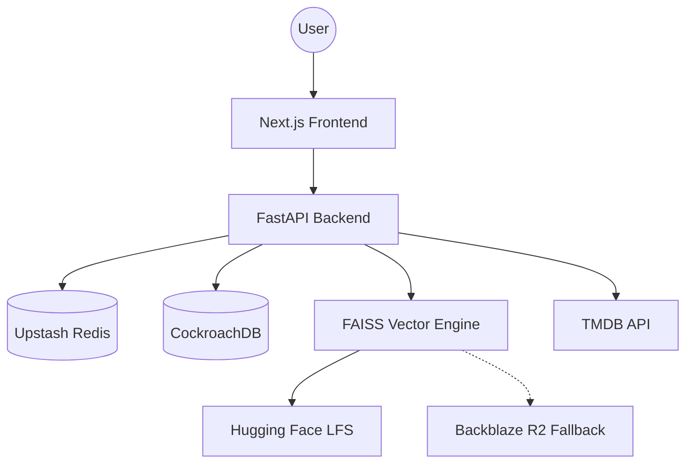

# 🎬 CineRecs — AI-Powered Movie Discovery

<div align="center">
  
  
  
  
  
</div>

---

### 🌟 Overview
**CineRecs** is a premium, full-stack movie recommendation engine that combines **Semantic Search** with **Collaborative Filtering** to deliver an unparalleled discovery experience. Built for speed and intelligence, it leverages state-of-the-art Vector Embeddings to understand *what* you want to watch, even when you don't know the title.

---

### 🔥 Key Features
*   **🤖 Semantic Discovery**: Search for movies by vibe, plot, or themes (e.g., *"Dark space thriller with a twist"*). Powered by `all-MiniLM-L6-v2` and FAISS.
*   **🧠 Hybrid Recommendation Engine**: Combines your viewing history (Collaborative) with movie similarities (Content-Based) for hyper-personalized results.
*   **⚡ Real-time Caching**: Powered by Upstash Redis for sub-10ms response times on popular queries.
*   **☁️ Resilient Architecture**: Hybrid-cloud storage using Cloudflare R2/Backblaze and Git LFS for ultra-reliable index management.
*   **💎 Premium UI**: A modern, glassmorphic interface built with Next.js and high-performance CSS.

---

### 🏗️ Architecture



---

### 🛠️ Tech Stack
| Layer | Technology |
| :--- | :--- |
| **Frontend** | Next.js 14, Vanilla CSS, Lucide Icons |
| **API** | FastAPI (Python 3.10+), Pydantic v2 |
| **Intelligence** | Sentence-Transformers, FAISS |
| **Database** | CockroachDB (PostgreSQL) |
| **Cache** | Redis (Upstash) |
| **Storage** | Cloudflare R2 / Backblaze |
| **Infrastructure** | Docker, GitHub Actions |

---

### 🚀 Getting Started

#### 1. Environment Setup
Create a `.env` file in the root:
```env
# Backend
DATABASE_URL=your_db_url
UPSTASH_REDIS_URL=your_redis_url
UPSTASH_REDIS_TOKEN=your_token
TMDB_API_KEY=your_key
JWT_SECRET=your_secret

# Storage
R2_ACCESS_KEY_ID=...
R2_SECRET_ACCESS_KEY=...
R2_ENDPOINT_URL=...
```

#### 2. Run with Docker
```bash
docker-compose up --build
```

#### 3. Manual Startup
```bash
# Backend
cd backend && pip install -r requirements.txt
uvicorn main:app --reload

# Frontend
cd frontend && npm install
npm run dev
```

---

### 📡 API Endpoints
*   `GET /movies/search/semantic`: High-accuracy vector search.
*   `GET /recommend/personalized`: Custom engine results.
*   `GET /movies/discover`: Dynamic rows based on genres and popularity.

---

### 🤝 Contributing
Contributions are welcome! Whether it's UI tweaks or ML model improvements, feel free to fork and PR.

<div align="center">
  <p>Built with ❤️ by Pritam</p>
</div>
